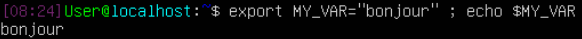
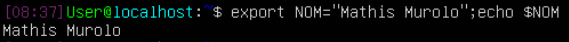
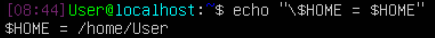
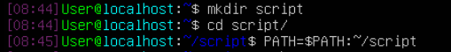
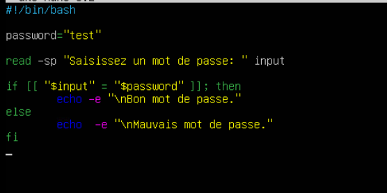
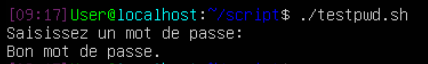

# Exercice 1. Variables d'environnement

1.  Dans quels dossiers bash trouve-t-il les commandes tapées par
    l'utilisateur ?

> **/usr/local/sbin, /usr/local/bin, /usr/sbin, /usr/bin, /sbin, /bin,
/usr/games, /usr/local/games et /snap/bin.**

2.  Quelle variable d'environnement permet à la commande **cd** tapée
    sans argument de vous ramener dans votre répertoire personnel ?

> **\$HOME**

3.  Explicitez le rôle des variables **LANG**, **PWD**, **OLDPWD**,
    **SHELL**.

>**La variable d\'environnement LANG permet de définir la langue d\'un
système Linux. PWD correspond à l'environnement de travail actuel et
OLDPWD à l'environnement de travail précédent, enfin la variable SHELL
localise l'emplacement du shell.**

4.  Créez une variable locale **MY_VAR** (le contenu n'a pas
    d'importance). Vérifiez que la variable existe.

>

5.  Tapez ensuite la commande **bash**. Que fait-elle ? La variable
    **MY_VAR** existe-t-elle ? Expliquez. A la fin de cette question,
    tapez la commande **exit** pour revenir dans votre session initiale.

>**Non la variable MY_VAR n'existe plus parce que la commande « bash »
ouvre un autre environnement bash avec les variables locales
réinitialisées.**

6.  Transformez **MY_VAR** en une variable d'environnement et
    recommencez la question précédente. Expliquez.

>**La variable est cette fois-ci toujours accessible parce qu'elle est
définie pour tous les environnements.**

7.  Créer la variable d'environnement **NOM** ayant pour contenu vos
    prénom et nom séparés par un espace. Afficher la valeur de **NOM**
    pour vérifier que l'affectation est correcte.

>

8.  Ecrivez une commande qui affiche "Bonjour à vous, *prenom nom* !" en
    utilisant la variable **NOM**.

>

9.  Quelle différence y a-t-il entre donner une valeur vide à une
    variable d'environnement et l'utilisation de la commande **unset** ?

>**La variable unset va désaffecter la variable tandis qu'une valeur vide
fera toujours apparaître la variable comme existante.**

10. Utilisez la commande **echo** pour écrire **exactement** la phrase :
    \$HOME = *chemin* (où chemin est votre dossier personnel **d'après
    bash**)

>

**Programmation Bash**

Vous enregistrerez vos scripts dans un dossier **script** que vous
créerez dans votre répertoire personnel.

Tous les scripts sont bien entendu à **tester**.

Ajoutez le chemin vers **script** à votre **PATH** de manière
permanente.

> 

# Exercice 2. Contrôle de mot de passe

Écrivez un script **testpwd.sh** qui demande de saisir un mot de passe
et vérifie s'il correspond ou non au contenu d'une variable PASSWORD
dont le contenu est codé en dur dans le script. Le mot de passe saisi
par l'utilisateur ne doit pas s'afficher.

> 
>
> 

# Exercice 3. Expressions rationnelles

Ecrivez un script qui prend un paramètre et utilise la fonction
suivante pour vérifier que ce paramètre est un nombre réel :

```
function is_number()
{
    re='^[+-]?[0-9]+([.][0-9]+)?$'
    if [[ $1 =~ $re ]] ; then
        return 1
    else
        return 0
    fi
}
```

Il affichera un message d'erreur dans le cas contraire.

```bash
#!/bin/bash

function is_number()
{
    re='^[+-]?[0-9]+([.][0-9]+)?$'
    if [[ $1 =~ $re ]] ; then
        return 1
    else
        return 0
    fi
}

if [ "$#" -eq 0 ] || [ "$#" -gt 1 ]; then
    echo "Utilisation: $0 nombre"
else
    is_number $1
    result=$?

    if [ $result –eq 1 ]; then
        echo -e "\nCe nombre est un réel"
    else
        echo -e "\nCe nombre n’est pas un réel"
    fi
fi
```

# Exercice 4. Contrôle d'utilisateur

Écrivez un script qui vérifie l'existence d'un utilisateur dont le nom
est donné en paramètre du script. Si le script est appelé sans nom
d'utilisateur, il affiche le message : "Utilisation : *nom_du_script*
nom_utilisateur", où nom_du_script est le nom de votre script récupéré
automatiquement (si vous changez le nom de votre script, le message
doit changer automatiquement)

```bash
#!/bin/bash

if [ "$#" -eq 0 ] || [ "$#" -gt 1 ]; then
    echo "Utilisation: $0 nom_utilisateur"
else
    if id "$1" &>/dev/null; then
        echo -e "\nL'utilisateur existe !"
    else
        echo -e "\nUtilisateur inexistant."
    fi
fi
```

# Exercice 5. Factorielle

```bash
#!/bin/bash

factorielle () {
        local counter=$1
        local factorial=1
        
        while [ "$counter" -gt 0 ]
        do
           factorial=$(( $factorial * $counter ))
           counter=$(( $counter - 1 ))
        done
        
        return $factorial
}

read -p "Entrer un nombre réel entier: " input
factorielle $input

result=$?

echo -e "\nLa factorielle de $input est $result"
```

# Exercice 6. Le juste prix

Écrivez un script qui génère un nombre aléatoire entre 1 et 1000 et
demande à l'utilisateur de le deviner. Le programme écrira "C'est plus
!", "C'est moins !" ou "Gagné !" selon les cas (vous utiliserez
\$RANDOM).

```bash
#!/bin/bash

prix=$RANDOM
read -p $'Quel est le prix ?\n' guess

while ! [ "$guess" -eq "$prix" ]
do
        if [ "$guess" -gt "$prix" ]; then
            echo -e "\nPlus petit !"
            read -p $'Quel est le prix ?\n' guess
        else
            echo -e "\nPlus petit !"
            read -p $'Quel est le prix ?\n' guess
        fi
done

echo -e "\nBien joué ! Le juste prix était bien $prix"
```

# Exercice 7. Statistiques

1.  Écrivez un script qui prend en paramètres trois entiers (entre -100
    et +100) et affiche le min, le max et la moyenne. Vous pouvez
    réutiliser la fonction de l'exercice 3 pour vous assurer que les
    paramètres sont bien des entiers.

```bash
 #!/bin/bash

function is_number()
{
    re='^[+-]?[0-9]+([.][0-9]+)?$'
    if [[ $1 =~ $re ]] ; then
        return 1
    else
        return 0
    fi
}

nbr_params=0
total=$#
is_first=1

if [ "$total" -gt 3 ]; then
    echo -e "\nErreur ! La fonction n'accepte que trois arguments."
else
    while (("$#"))
    do
        is_number $1
        isnbr=$?
        if [ "$isnbr" -eq 1 ] && [ "$1" -ge "-100" ] && [ "$1" -le 100 ]; then
            if [ "$is_first" -eq 1 ]; then
                max=$1
                min=$1
                is_first=0
            else
                if [ "$1" -gt "$max" ]; then
                    max=$1
                elif [ "$1" -lt "$min" ]; then
                    min=$1
                fi
            fi

            nbr_params=$(( $nbr_params + 1 ))
        else
            echo -e "\nErreur ! $1 n'est pas un entier réel comprit entre -100 et 100."
        fi
    shift
    done

    average=$(( $total / $nbr_params ))

    echo -e "\nMinimum: $min\nMaximum: $max\nMoyenne: $average"
fi
```

2.  Généralisez le programme à un nombre quelconque de paramètres
    (pensez à SHIFT)

```bash
#!/bin/bash

function is_number()
{
    re='^[+-]?[0-9]+([.][0-9]+)?$'
    if [[ $1 =~ $re ]] ; then
        return 1
    else
        return 0
    fi
}

nbr_params=0
total=$#
is_first=1

while (("$#"))
do
    is_number $1
    isnbr=$?
    if [ "$isnbr" -eq 1 ] && [ "$1" -ge "-100" ] && [ "$1" -le 100 ]; then
        if [ "$is_first" -eq 1 ]; then
            max=$1
            min=$1
            is_first=0
        else
            if [ "$1" -gt "$max" ]; then
                max=$1
            elif [ "$1" -lt "$min" ]; then
                min=$1
            fi
        fi

        nbr_params=$(( $nbr_params + 1 ))
    else
        echo -e "\nErreur ! $1 n'est pas un entier réel comprit entre -100 et 100."
    fi
shift
done

average=$(( $total / $nbr_params ))

echo -e "\nMinimum: $min\nMaximum: $max\nMoyenne: $average"
```

3.  Modifiez votre programme pour que les notes ne soient plus données
    en paramètres, mais saisies et stockées au fur et à mesure dans un
    tableau.

```bash
#!/bin/bash

function is_number()
{
    re='^[+-]?[0-9]+([.][0-9]+)?$'
    if [[ $1 =~ $re ]] ; then
        return 1
    else
        return 0
    fi
}

declare -a params_array
total=$#
is_first=1

read -p "Entrer le nombre de paramètres: " nbr_params

for i in $(seq 0 $(( "$nbr_params" - 1 ))); do
    read -p $'Entrer un nombre réel entier comprit entre -100 et 100\n' params_array["$i"]
done


for param in ${params_array[*]};
do
    is_number "$param"
    isnbr=$?
    if [ "$isnbr" -eq 1 ] && [ "$param" -ge "-100" ] && [ "$param" -le 100 ]; then
        if [ "$is_first" -eq 1 ]; then
            max=$param
            min=$param
            is_first=0
        else
            if [ "$param" -gt "$max" ]; then
                max=$param
            elif [ "$param" -lt "$min" ]; then
                min=$param
            fi
        fi

        nbr_params=$(( $nbr_params + 1 ))
    else
        echo -e "\nErreur ! $param n'est pas un entier réel comprit entre -100 et 100."
    fi
done

average=$(( $total / $nbr_params ))

echo -e "\nMinimum: $min\nMaximum: $max\nMoyenne: $average 
```